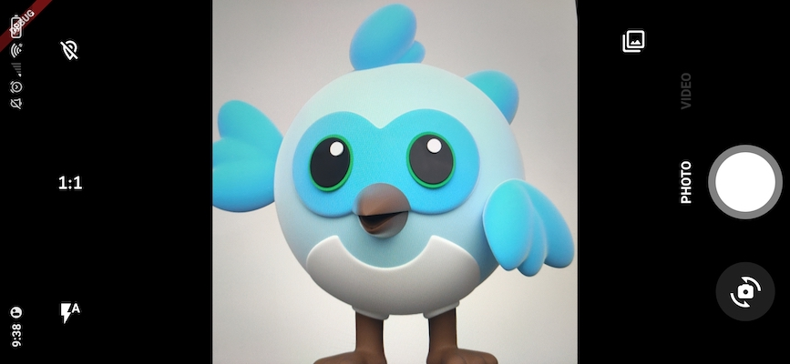
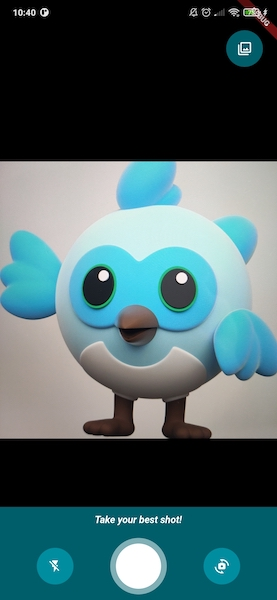

<a href="https://apparence.io">
  
</a>
<div style="margin-top:40px">
  
  
</div>

<br>

# CamerAwesome

<div>
    <a href="https://github.com/Solido/awesome-flutter">
        
    </a>
    <a href="https://github.com/Apparence-io/camera_awesome">
        
    </a>
    <a href="https://pub.dev/packages/camerawesome">
        
    </a>
</div>

[](https://github.com/Apparence-io/CamerAwesome/blob/master/README.md)

📸 简单轻松地在您自己的应用程序中嵌入相机。 <br>
这个 Flutter 插件集成了很棒的 Android / iOS 相机体验。 <br>

<br>
为您提供完全可定制的相机体验。<br>
使用我们出色的内置界面或根据需要对其进行自定义調整。

---

<div style="margin-top:16px;margin-bottom:16px">
  <a href="https://docs.page/Apparence-io/camera_awesome" style="">
    
  </a>
</div>

## Native features

Here's all native features that cameraAwesome provides to the flutter side.

| System                                   | Android |  iOS  |
| :--------------------------------------- | :-----: | :---: |
| 🔖 询问权限 | ✅ | ✅ |
| 🎥 录制视频 | ✅ | ✅ |
| 🔈 启用/禁用音频 | ✅ | ✅ |
| 🎞 拍照 | ✅ | ✅ |
| 🌆 照片实时滤镜 | ✅ | ✅ |
| 🌤 曝光度 | ✅ | ✅ |
| 📡 直播图像流 | ✅ | ✅ |
| 🧪 图像分析（条形码扫描等）| ✅ | ✅ |
| 👁 放大 | ✅ | ✅ |
| 📸 闪光支持 | ✅ | ✅ |
| ⌛️ 自动对焦 | ✅ | ✅ |
| 📲 直播切换相机 | ✅ | ✅ |
| 😵‍💫 相机旋转流 | ✅ | ✅ |
| 🤐 后台自动停止 | ✅ | ✅ |
| 🔀 传感器类型切换 | ⛔️ | ✅ |
| 🪞 启用/禁用前置摄像头镜像 | ✅ | ✅ |

---

## 📖&nbsp; 安装使用

### 在你的 pubspec.yaml 中添加插件

```yaml
dependencies:
  camerawesome: ^1.3.0
  ...
```

### 平台设置

- **iOS**

在 `ios/Runner/Info.plist` 中添加这些：

```xml

<key>NSCameraUsageDescription</key>
<string>Your own description</string>

<key>NSMicrophoneUsageDescription</key>
<string>To enable microphone access when recording video</string>

<key>NSLocationWhenInUseUsageDescription</key>
<string>To enable GPS location access for Exif data</string>
```

- **Android**

在 `android/app/build.gradle` 中将最低 SDK 版本更改为 21（或更高）：

```
minSdkVersion 21
```

为了能够拍照或录制视频，您可能需要额外的权限，具体取决于 Android 版本和您要保存它们的位置。
在[官方文档](https://developer.android.com/training/data-storage)中阅读更多相关信息.
> `WRITE_EXTERNAL_STORAGE` 不包含在从 1.4.0 版开始的插件中。


如果您想录制附帶音频的视频，请将此权限添加到您的 `AndroidManifest.xml` 中：

```xml

<manifest xmlns:android="http://schemas.android.com/apk/res/android"
        package="com.example.yourpackage">
  <uses-permission android:name="android.permission.RECORD_AUDIO" />

  <!-- Other declarations -->
</manifest>
```

您可能还想将图片位置保存在 exif 元数据中。 在这种情况下，添加以下权限：

```xml
<manifest xmlns:android="http://schemas.android.com/apk/res/android"
  package="com.example.yourpackage">
  <uses-permission android:name="android.permission.ACCESS_FINE_LOCATION" />
  <uses-permission android:name="android.permission.ACCESS_COARSE_LOCATION" />

  <!-- Other declarations -->
</manifest>
```

<details>
<summary>⚠️ 覆写 Android 依赖</summary>

如果您有冲突，可以覆盖 CamerAwesome 使用的一些依赖项。
更改这些变量以定义您要使用的版本：

```gradle
buildscript {
  ext.kotlin_version = '1.7.10'
  ext {
    // You can override these variables
    compileSdkVersion = 33
    minSdkVersion = 24 // 21 minimum
    playServicesLocationVersion = "20.0.0"
    exifInterfaceVersion = "1.3.4"
  }
  // ...
}
```

仅当您确定自己在做什么时才更改这些变量。

例如，当您与其他插件发生冲突时，设置 Play Services Location 版本可能会有所帮助。
下行显示了这些冲突的示例：

```
java.lang.IncompatibleClassChangeError: Found interface com.google.android.gms.location.ActivityRecognitionClient, but class was expected
```

</details>

### 在你的 Flutter 应用中导入插件

```dart
import 'package:camerawesome/camerawesome_plugin.dart';
```

---

## 👌 很棒的内置界面

只需使用我们的构建器。 <br>
这就是在应用中创建完整相机体验所需的全部内容。

```dart
CameraAwesomeBuilder.awesome(
  saveConfig: SaveConfig.image(
    pathBuilder: _path(),
  ),
  onMediaTap: (mediaCapture) {
    OpenFile.open(mediaCapture.filePath);
  },
),
```



可以使用各种设置自定义此构建器：

- 一个主题
- 屏幕每个部分的构建器
- 初始相机设置
- 预览定位
- 额外的预览装饰
- 和更多！

这是一个例子：



查看 [完整文档](https://docs.page/Apparence-io/camera_awesome/getting_started/awesome-ui) 以了解更多信息。

---

## 🎨 创建自定义界面

如果 `awesome()` 工厂不够用，您可以使用 `custom()` 代替。

它提供了一个 `builder` 属性，可让您创建自己的相机体验。 <br>

相机预览将在您提供给构建器的内容后面显示。

```dart
CameraAwesomeBuilder.custom(
  saveConfig: SaveConfig.image(pathBuilder: _path()),
  builder: (state, previewSize, previewRect) {
    // create your interface here
  },
)
```

> 在 [文档](https://docs.page/Apparence-io/camera_awesome/getting_started/custom-ui) 中查看更多信息

### 使用自定义构建器

这是我们的构建器方法的定义。

```dart
typedef CameraLayoutBuilder = Widget Function(CameraState cameraState, PreviewSize previewSize, Rect previewRect);
```

<br>
您唯一有权管理相机的是 cameraState。<br>
根据我们的相机状态，您可以使用一些不同的方法。 <br>
`previewSize` 和 `previewRect` 可用于将 UI 放置在相机预览周围或之上。
<br>

#### CamerAwesome 状态如何工作？

使用状态，可以做任何您需要的事情，而无需考虑相机流程<br>
- 在应用程序启动时，我们处于 `PreparingCameraState`<br>
- 然后根据您设置的 initialCaptureMode，您将是 `PhotoCameraState` 或 `VideoCameraState`<br>
- 启动视频将推送 `VideoRecordingCameraState`<br>
- 停止视频将推回 `VideoCameraState`<br>

另外，如果你想使用一些特定的功能，你可以这样写。

```dart
state.when(
  onPhotoMode: (photoState) => photoState.start(),
  onVideoMode: (videoState) => videoState.start(),
  onVideoRecordingMode: (videoState) => videoState.pause(),
);
```

> 在 [文档](https://docs.page/Apparence-io/camera_awesome/getting_started/custom-ui) 查看更多信息

<br>

---

## 🔬 分析模式

使用它来实现：

- 二维码扫描。
- 面部识别。
- 人工智能对象检测。
- 实时视频聊天。
- 还有更多🤩


您可以在 `example` 目录中使用 MLKit 示例。
上面的例子来自 `ai_analysis_faces.dart`。 它检测人脸并绘制他们的轮廓。

也可以使用 MLKit 读取条形码：


检查 `ai_analysis_barcode.dart` 和 `preview_overlay_example.dart` 以获取示例或查看 [文档](https://docs.page/Apparence-io/camera_awesome/ai_with_mlkit/reading_barcodes)。

### 如何使用它

```dart
CameraAwesomeBuilder.awesome(
  saveConfig: SaveConfig.image(
    pathBuilder: _path(),
  ),
  onImageForAnalysis: analyzeImage,
  imageAnalysisConfig: AnalysisConfig(
        // Android specific options
        androidOptions: const AndroidAnalysisOptions.nv21(
            // Target width (CameraX will chose the closest resolution to this width)
            width: 250,
        ),
        // Wether to start automatically the analysis (true by default)
        autoStart: true,
        // Max frames per second, null for no limit (default)
        maxFramesPerSecond: 20,
    ),
```

> MLkit 推荐安卓使用 nv21 格式。 <br>
> bgra8888 是 iOS 格式
> 对于机器学习，您不需要全分辨率图像（720 或更低的图像就足够了，并且使计算更容易）

在 [文档](https://docs.page/Apparence-io/camera_awesome/ai_with_mlkit/image_analysis_configuration) 中了解有关图像分析配置的更多信息.

另请查看有关如何使用 MLKit [读取条形码](https://docs.page/Apparence-io/camera_awesome/ai_with_mlkit/reading_barcodes) 和 [检测人脸](https://docs.page/Apparence-io/camera_awesome/ai_with_mlkit/detecting_faces) 的详细说明.

⚠️ 在Android 上，部分设备不支持同时进行视频录制和图像分析。

- 如果他们不这样做，图像分析将被忽略。
- 您可以使用 `CameraCharacteristics.isVideoRecordingAndImageAnalysisSupported(Sensors.back)` 检查设备是否具有此功能。

---

## 🐽 更新传感器配置

通过状态，您可以访问 `SensorConfig` 类。


| 函式 | 描述 |
| ------------------ | ---------------------------------------------------- |
| setZoom | 改变缩放 |
| setFlashMode | 在 NONE、ON、AUTO、ALWAYS 之间更改闪光灯 |
| setBrightness | 手动更改亮度级别（最好让这个自动） |
| setMirrorFrontCamera | 为前置摄像头设置镜像 |

所有这些配置都可以通过流进行监听，因此您的 UI 可以根据实际配置自动更新.

<br>

## 🌆 照片实时滤镜

使用内置界面将实时滤镜应用于您的图片：


您还可以选择从一开始就使用特定的过滤器：

```dart
CameraAwesomeBuilder.awesome(
  // other params
  filter: AwesomeFilter.AddictiveRed,
)
```

或者以编程方式设置过滤器：

```dart
CameraAwesomeBuilder.custom(
  builder: (cameraState, previewSize, previewRect) {
    return cameraState.when(
      onPreparingCamera: (state) =>
      const Center(child: CircularProgressIndicator()),
      onPhotoMode: (state) =>
          TakePhotoUI(state, onFilterTap: () {
            state.setFilter(AwesomeFilter.Sierra);
          }),
      onVideoMode: (state) => RecordVideoUI(state, recording: false),
      onVideoRecordingMode: (state) =>
          RecordVideoUI(state, recording: true),
    );
  },
)
```

查看 [文档](https://docs.page/Apparence-io/camera_awesome/widgets/awesome_filters) 中的所有可用过滤器.

<br>

<a href="https://apparence.io">
  
</a>

<br>

<a href="https://apparencekit.dev">
  
</a>
